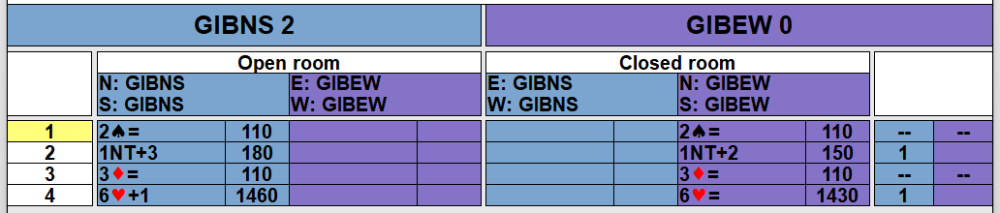

This is the output from a match between 4 GIB-robots

[Match 1.pbn](./Match%201.pbn) is the boards to be played

[RunBM.cmd](runBM.cmd) starts for robots and expect to connect to Bridge Moniteur

[Match- GIBNS v GIBEW](Match-%20GIBNS%20v%20GIBEW.pbn) is the boards after being played. Be aware that BridgeMoniteur is using instant replay and rotating the boards for replay

So here we use [TMPbn2LinVG.exe](../dist/TMPbn2LinVG.exe) to create the lin-file for VuGraph

The final result is in
[Match- GIBNS v GIBEW 1-4](Match-%20GIBNS%20v%20GIBEW%201-4.lin)

Final result

Using Blue CHip Table Manager we use

[RunBM.cmd](runBM.cmd) tostart the robots.

