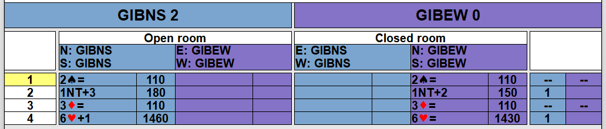

# Example Files

Sample files demonstrating robot match setup and output.

## Running Robot Matches

| Script | Table Manager | Description |
|--------|---------------|-------------|
| [runBM.cmd](runBM.cmd) | Bridge Moniteur | Starts four GIB robots on port 2000 |
| [runBC.cmd](runBC.cmd) | Blue Chip | Starts robots for Blue Chip Table Manager |
| [runBBA.cmd](runBBA.cmd) | BBA | Starts robots for BBA |

## Sample Match Files

[Match 1.pbn](./Match%201.pbn) - Input boards to be played

[Match- GIBNS v GIBEW.pbn](Match-%20GIBNS%20v%20GIBEW.pbn) - Output after playing. Note: Bridge Moniteur uses instant replay and rotates boards.

[Match- GIBNS v GIBEW 1-4.lin](Match-%20GIBNS%20v%20GIBEW%201-4.lin) - LIN file created with TMPbn2LinVG for NetBridgeVu viewing

## Blue Chip / Bridge Composer Files

Files for formatting Blue Chip robot results using Bridge Composer:

| File | Description |
|------|-------------|
| [BCConst.js](BCConst.js) | Bridge Composer constants |
| [BCDeal.js](BCDeal.js) | Bridge Composer deal handling |
| [TextConvert.wsf](TextConvert.wsf) | Windows Script for text conversion |
| [txtcvt.wsf](txtcvt.wsf) | Text conversion utility |
| [Match- GIBNS v GIBEW BC.pbn](Match-%20GIBNS%20v%20GIBEW%20BC.pbn) | Blue Chip match output |
| [GIBNS v GIBEW.rpt](GIBNS%20v%20GIBEW.rpt) | Match report |
