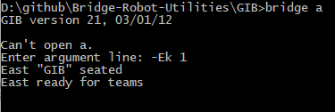
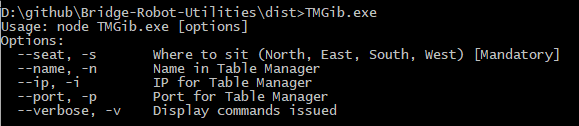

# Bridge-Robot-Utilities
Some utilities for arranging matches between robots playing bridge.

# TMPbn2LinVG 
used for translating PBN-files from [Bridge Moniteur](http://www.wbridge5.com/bm.htm) - a table manager - into lin-files, that can be viewed in [NetBridgeVu.exe] (https://www.bridgebase.com/intro/installation_guide_for_bbo.php).


# TMGib
Enables GIB to called from a table monitor.

# Installation
You can clone this repository or just download the two executables in the dist/ folder.

You will have to copy the GIB-executable as it is not included in this repository.

Just place it in a folder of your own choice - the program expects to find GIB in a subfolder called GIB

These files should be present in the GIB folder

- bridge.exe
- MB.TXT
- Comments.txt
- EVAL.DAT
- gib.ini

Test it works by writing:

```bridge a ```
then ```-Ek 1``` in argument line. 
Press enter and it will just move to next line. 
Now enter ```East "GIB" seated``` and if you get the response ```East ready for teams``` it should be ok.



Open a command prompt and navigate to the folder where you placed TMGib.exe.

Start your Table Monitor (Bridge Moniteur as example with Instant replay)

In the prompt you type TMGib and enter and should get something like this:



So enter

```TMGib -S North -n GIB```

to use in Bridge Moniteur as it default to port 2000 at the local machine

Repeat for number of bots

A nice little trick you can use is commands like

```start "North" /D . TMGib.exe -s North -n GIBNS```

that will start the program in a new window.

So it could look like this


When done playing you can see the result in TM, but there is also a PBN saved.

The PBN can be translated to Lin by downloading TMPbn2LinVG.exe from this repository.

TMGib supports the following command line parameters:

-  --seat, -s       Where to sit (North, East, South, West) [Mandatory]
-  --name, -n       Name in Table Manager - default GIB
-  --ip, -i         IP for Table Manager - default 127.0.0.1
-  --port, -p       Port for Table Manager - default 2000
-  --timing, -t     time (secs) for one GIB to play one board, on average - Default 60
-  --bidding, -b    Tell GIB to use sys.ns sys.ew as input - default False
-  --delay, -d      Delay between commands, default 100 ms
-  --gibdir, -g     Directory where to find GIB executables - default ./GIB
-  --simdecl, -m    number of deals to analyze to pick a play as declarer - default 50
-  --simdef, -e     number of deals to analyze to pick a play as defender - default 50
-  --verbose, -v    Display commands issued to GIB and other interesting logging - default False


