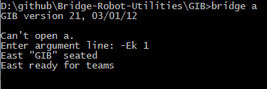
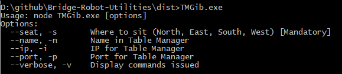
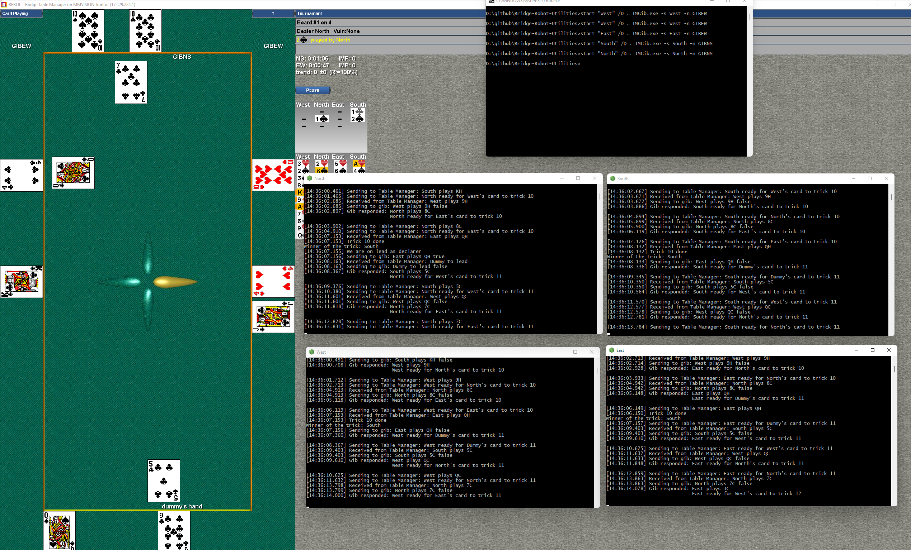

# Bridge-Robot-Utilities
Some utilities for arranging and displaying the result of matches between robots playing bridge.

# TMPbn2LinVG 
Used for translating PBN-files from [Bridge Moniteur](http://www.wbridge5.com/bm.htm) - a table manager - into lin-files, that can be viewed in [NetBridgeVu.exe] (https://www.bridgebase.com/intro/installation_guide_for_bbo.php).

Each match will be split in 32 board sections.

# TMGib
Enables GIB to be called from a table monitor. Both Table Monitors are supported

## Installation
You can clone this repository or download a release with executables

You will have to copy the GIB-executable as it is not included in this repository.

Just place it in a folder of your own choice - the program expects to find GIB in a subfolder called GIB (But you can change it by sending a parameter)

These files should be present in the GIB folder

- bridge.exe
- MB.TXT
- Comments.txt
- EVAL.DAT
- gib.ini

Test it works by writing:

```bridge a ```
then ```-Ek 1``` in argument line. 
Press enter and it will just move to next line. 
Now enter ```East "GIB" seated``` and if you get the response ```East ready for teams``` it should be ok.



Open a command prompt and navigate to the folder where you placed TMGib.exe.

Start your Table Monitor (Bridge Moniteur as example with Instant replay)

In the prompt you type TMGib and enter and should get something like this:



So enter

```TMGib -S North -n GIB```

to use in Bridge Moniteur as it default to port 2000 at the local machine

Repeat for number of bots

A nice little trick you can use is commands like

```start "North" /D . TMGib.exe -s North -n GIBNS```

that will start the program in a new window.

So it could look like this


When done playing you can see the result in TM, but there is also a PBN saved.

The PBN can be translated to Lin by downloading TMPbn2LinVG.exe from this repository.

TMGib supports the following command line parameters:

-  --seat, -s       Where to sit (North, East, South, West) [Mandatory]
-  --name, -n       Name in Table Manager - default GIB
-  --ip, -i         IP for Table Manager - default 127.0.0.1
-  --port, -p       Port for Table Manager - default 2000
-  --timing, -t     time (secs) for one GIB to play one board, on average - Default 60
-  --bidding, -b    Tell GIB to use sys.ns sys.ew as input - default False
-  --delay, -d      Delay between commands, default 100 ms
-  --gibdir, -g     Directory where to find GIB executables - default ./GIB
-  --simdecl, -m    number of deals to analyze to pick a play as declarer - default 50
-  --simdef, -e     number of deals to analyze to pick a play as defender - default 50
-  --verbose, -v    Display commands issued to GIB and other interesting logging - default False


# TMMediator
This program allows you to play with Blue Chip Bridge using Bridge Moniteur.

This program will listen on 4 ports and send it all to Bridge Moniteur, and send the response back to individual clients.

TMMediator is listening on ports 2001-2004 and you can follow the communication between the programs

Now Blue Chip can handle all 4 robots in the same program, or you can start 4 instances of Blue Chip (I did the first and that could explain the randomness was resulting in 0-0)

So just go to Network play and click on all 4 directions. You need to change port for North from 2000 to 2004 as 2000 is used by Bridge Moniteur.

# TMPbn2DDS

This utility will take a pbn-file from Bridge Moniteur with instant replay and remove some non-standard lines, and rotate the deal from the replay, so the file can be opened in Double Dummy Solver, or Bridge Composer.

# printmatchashtml

Based on the output from TMPbn2DDS this utility will create an index file with the results from all boards and with a link to each Board played. The link is to a file called BEN.htm, and is expected to be produces using Bridge Composer (using the script FormatMatch and Save as HTML).

# TMPbn2Cleaner

Utility to clean a pbn-file for certain non-standard lines.

# CalculateMatch

Merges PBN-file from open and closed room into one new file for a match.

# MergePBNFiles
Scans a directory (including subdirectories) and merge all PBN-files into one new PBe

# CountPBNBoards
Count the number of boards in a PBN-file

# ResetAndRenumberPBNBoards
Renumber all boards in a PBN-file. Be aware that any play information is removed in the processing

# Split_PBN
Based on Double Dummy results in the PBN-file, this application split the file in three. Doubled contracts making, result more than 2000 away from the par result and the rest

# PBN2LinUI
A simple application, that converts a PBN-file to a LIN-file

# csvlin2pbn
Convert a csv-file from Danish Bridge federation to a .PBN-file

# ExtractLinks
Extract challenge match from BBO as PBN

# comparematchpbnashtml
Compare two matches (typical replay between robots) and present the result as html
Each deal is presented in the handviewer

# comparerobots
Select a PBN-file from each robot and create an HTML comparison report showing bidding and play results side-by-side with tricks, scores, IMP differences, and a final summary table

# listmatchpbnashtml
Merging multiple PBN-files with the same boards into one html-file, so it is possible to compare all results for a round in the same file
Each deal is presented in the handviewer.
The html-page is standalone and require no stylesheet or script

# PBN2LIN
Command-line utility to convert a PBN-file to LIN format. Output filename is optional (defaults to input filename with .lin extension)

# LIN2PBN
Command-line utility to convert a LIN-file to PBN format. Output filename is optional (defaults to input filename with .pbn extension)

# Lin2PBNUI
A simple application, that converts a LIN-file to a PBN-file

# ExtractDatumScore
Extracts optimum scores and par contracts from a PBN-file and saves them to a pickle file (DatumScores.pkl) for later analysis.

The pickle is keyed by the exact `[Deal "..."]` line. Each value starts as a 3-tuple `(OptimumScore, ParContract, vulnerability)` and, once `ComputeDDTables` has run, becomes a 4-tuple with a fourth element holding the packed 20-cell double-dummy result table. This is the shared cache used by `AddDatumScore` and `Split_PBN`.

# ComputeDDTables
Fills `DatumScores.pkl` with double-dummy result tables. It reads the pickle, double-dummy solves every deal that does not yet have a table (via endplay/DDS), and rewrites each entry as a 4-tuple `(OptimumScore, ParContract, vulnerability, dd_bytes)`, where `dd_bytes` is 20 bytes — one trick count per (declarer, denomination) in the order N/E/S/W × S/H/D/C/NT.

This is the expensive, one-time step (it can take a few hours for a large pickle). It is **resumable**: worker processes checkpoint their progress (`dd_ckpt_*.pkl`), so an interrupted run continues where it left off, and the original pickle is backed up to `DatumScores.pkl.bak` and replaced atomically. Solving is done with a small number of worker processes (DDS already threads internally; override the default with the `DD_WORKERS` environment variable).

```cmd
python src/ComputeDDTables.py DatumScores.pkl
```

Not shipped as an executable (endplay's double-dummy solver is a developer-side, source-only step); run it from source.

# ComputeDatumScores
Computes datum scores for a PBN whose deals have **no score tags at all** (only `[Deal ...]`, e.g. a file of random deals) and adds them to `DatumScores.pkl`. For each deal it double-dummy solves the table, derives `OptimumScore` and `ParContract` from the par calculation (using the board's `[Vulnerable]` and `[Dealer]`), and stores a full `(OptimumScore, ParContract, vulnerability, dd_bytes)` entry.

Use this when `ExtractDatumScore` can't help because there are no tags to extract. Afterwards `AddDatumScore` can annotate the PBN from the now-populated pickle.

```cmd
python src/ComputeDatumScores.py input.pbn DatumScores.pkl
```

Like `ComputeDDTables`, this is the expensive one-time step (hours for a large file), resumable via worker checkpoints, and it backs up/rewrites the pickle atomically. Not shipped as an executable; run it from source.

# AddDatumScore
Annotates a PBN-file from `DatumScores.pkl`, writing one output file. For every board it looks the deal up in the pickle and inserts `[OptimumScore]`, `[ParContract]`, and — when the pickle entry has been enriched by `ComputeDDTables` — the standard 20-row `[OptimumResultTable]`, grouped after the `[Deal]` tag.

It edits the file as text (not through endplay), so all other tags, comments, auctions and play lines are preserved byte-for-byte and non-standard board labels (e.g. `T1`) are kept. It streams one board at a time (handles multi-hundred-MB files), is idempotent (re-running replaces the tags it manages rather than duplicating them), and passes boards through unchanged when a deal is not in the pickle.

```cmd
python src/AddDatumScore.py input.pbn DatumScores.pkl output.pbn
```

Run with no arguments for the file-picker GUI. Output filename defaults to `<input>-DD.pbn`.

## Prebuilt DatumScores.pkl

A prebuilt, DD-enriched `DatumScores.pkl` is attached to the GitHub release as **`DatumScores.zip`** (the raw pickle is too large to ship in the repo). To use it:

1. Download `DatumScores.zip` from the [latest release](https://github.com/ThorvaldAagaard/Bridge-Robot-Utilities/releases/latest).
2. Unzip it to get `DatumScores.pkl`.
3. Put `DatumScores.pkl` in the folder you run the tools from — `AddDatumScore` (when no pickle path is given) and `Split_PBN` look for `DatumScores.pkl` in the current working directory.

You only need this if you want the shared datum-score/double-dummy cache; otherwise you can rebuild it yourself with `ExtractDatumScore` followed by `ComputeDDTables`.

## Prebuilt board datasets

Two annotated board sets are attached to the GitHub release (zipped, as the raw files are hundreds of MB):

- **`TrainingDeals.zip`** — ~1.18M boards with bidding/play, each annotated with `OptimumScore`, `ParContract` and the 20-row `OptimumResultTable`.
- **`RandomDeals.zip`** — 1M random deals, each annotated with `OptimumScore`, `ParContract` and the `OptimumResultTable` (computed double-dummy).

Download from the [latest release](https://github.com/ThorvaldAagaard/Bridge-Robot-Utilities/releases/latest) and unzip to get the `.pbn`.

# PbnExtractBoards
Extracts unique boards from a PBN-file, removing duplicate deals and renumbering boards sequentially

# benchmark (source only - not in releases)
A developer script (`src/benchmark.py`) for comparing machines used in robot matches. Tests NumPy operations (matrix multiply, SVD, FFT), TensorFlow matrix operations (if installed), disk I/O (100MB read/write), and JSON serialization. Produces a weighted score (NumPy 40%, TensorFlow 30%, I/O 20%, JSON 10%) useful for evaluating hardware before running neural-network-based robots like BEN.

This is **not** shipped as an executable (bundling TensorFlow produces a ~530 MB binary). Run it directly from source instead:

```cmd
python src/benchmark.py
```

