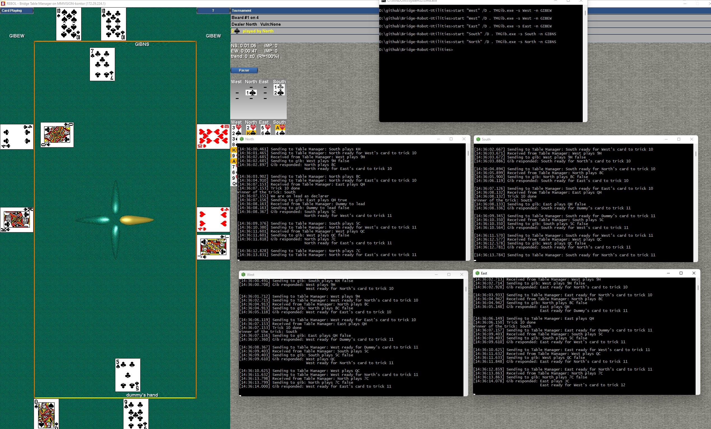

# Bridge-Robot-Utilities
Some utilities for arranging and displaying the result of matches between robots playing bridge.

# TMPbn2LinVG 
Used for translating PBN-files from [Bridge Moniteur](http://www.wbridge5.com/bm.htm) - a table manager - into lin-files, that can be viewed in [NetBridgeVu.exe] (https://www.bridgebase.com/intro/installation_guide_for_bbo.php).

Each match will be split in 32 board sections.

# TMGib
Enables GIB to be called from a table monitor. Both Table Monitors are supported

## Installation
You can clone this repository or download a release with executables

You will have to copy the GIB-executable as it is not included in this repository.

Just place it in a folder of your own choice - the program expects to find GIB in a subfolder called GIB (But you can change it by sending a parameter)

These files should be present in the GIB folder

- bridge.exe
- MB.TXT
- Comments.txt
- EVAL.DAT
- gib.ini

Test it works by writing:

```bridge a ```
then ```-Ek 1``` in argument line. 
Press enter and it will just move to next line. 
Now enter ```East "GIB" seated``` and if you get the response ```East ready for teams``` it should be ok.


Open a command prompt and navigate to the folder where you placed TMGib.exe.

Start your Table Monitor (Bridge Moniteur as example with Instant replay)

In the prompt you type TMGib and enter and should get something like this:


So enter

```TMGib -S North -n GIB```

to use in Bridge Moniteur as it default to port 2000 at the local machine

Repeat for number of bots

A nice little trick you can use is commands like

```start "North" /D . TMGib.exe -s North -n GIBNS```

that will start the program in a new window.

So it could look like this


When done playing you can see the result in TM, but there is also a PBN saved.

The PBN can be translated to Lin by downloading TMPbn2LinVG.exe from this repository.

TMGib supports the following command line parameters:

-  --seat, -s       Where to sit (North, East, South, West) [Mandatory]
-  --name, -n       Name in Table Manager - default GIB
-  --ip, -i         IP for Table Manager - default 127.0.0.1
-  --port, -p       Port for Table Manager - default 2000
-  --timing, -t     time (secs) for one GIB to play one board, on average - Default 60
-  --bidding, -b    Tell GIB to use sys.ns sys.ew as input - default False
-  --delay, -d      Delay between commands, default 100 ms
-  --gibdir, -g     Directory where to find GIB executables - default ./GIB
-  --simdecl, -m    number of deals to analyze to pick a play as declarer - default 50
-  --simdef, -e     number of deals to analyze to pick a play as defender - default 50
-  --verbose, -v    Display commands issued to GIB and other interesting logging - default False


# TMMediator
This program allows you to play with Blue Chip Bridge using Bridge Moniteur.

This program will listen on 4 ports and send it all to Bridge Moniteur, and send the response back to individual clients.

TMMediator is listening on ports 2001-2004 and you can follow the communication between the programs

Now Blue Chip can handle all 4 robots in the same program, or you can start 4 instances of Blue Chip (I did the first and that could explain the randomness was resulting in 0-0)

So just go to Network play and click on all 4 directions. You need to change port for North from 2000 to 2004 as 2000 is used by Bridge Moniteur.

# TMPbn2DDS

This utility will take a pbn-file from Bridge Moniteur with instant replay and remove some non-standard lines, and rotate the deal from the replay, so the file can be opened in Double Dummy Solver, or Bridge Composer.

# printmatchashtml

Based on the output from TMPbn2DDS this utility will create an index file with the results from all boards and with a link to each Board played. The link is to a file called BEN.htm, and is expected to be produces using Bridge Composer (using the script format match and save as HTML).

# TMPbn2Cleaner

Utility to clean a pbn-file for certain non-standard lines.

# CalculateMatch

Merges PBN-file from open and closed room into one new file for a match.

# MergePBNFiles
Scans a directory (including subdirectories) and merge all PBN-files into one new PBe

# CountPBNBoards
Count the number of boards in a PBN-file
